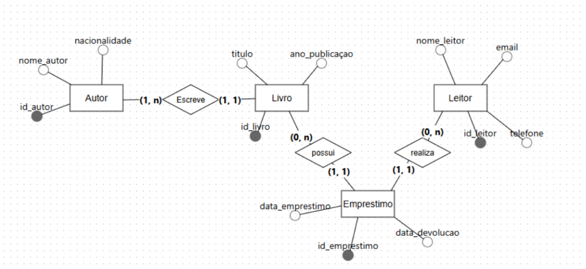
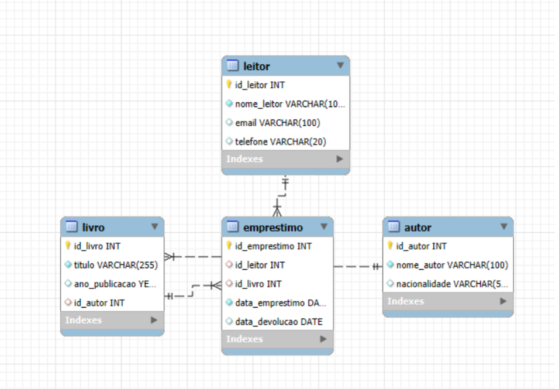
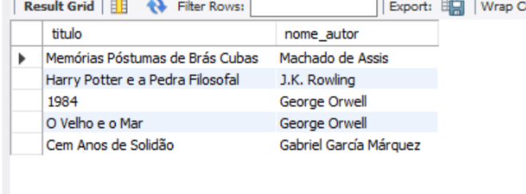
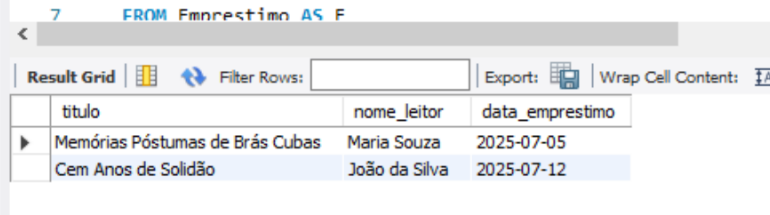
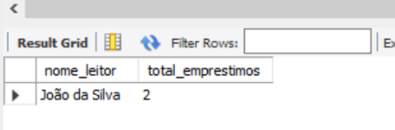

# Banco-de-Dados Projeto - Biblioteca

### Descrição do projeto
 ### Este projeto consiste na criação de um banco de dados relacional para uma biblioteca, utilizando o MySQL. O objetivo é modelar, implementar e manipular um sistema que gerencia informações sobre livros, autores, leitores e o histórico de empréstimos.

### Programas usados durante o processo
 - Modelagem: BRModelo
 - SGBD: MySQL

 ---

 ### Modelagem do Banco de dados 

 ### Modelo conceitual 
  ### O modelo de dados conceitual (MER) foi construído com as seguintes entidades e relacionamentos:
  - Entidades: Autor, Livro, Leitor e Emprestimo.
  - Relacionamentos: 
    - Autor (1:N) Livro: Um autor pode escrever muitos livros.  

    - Leitor (1:N) Emprestimo: Um leitor pode realizar muitos empréstimos.

    - Livro (1:N) Emprestimo: Um livro pode estar em muitos empréstimos ao longo do tempo.

    ## Foto do Modelo conceitual: 

---
---

### Modelo lógico e físico 

### Foto do modelo lógico (com base no modelo conceitual)

---

### Consultas - exemplos
---
- exemplo 1

---

- exemplo 2

---

- Exemplo 3 

---